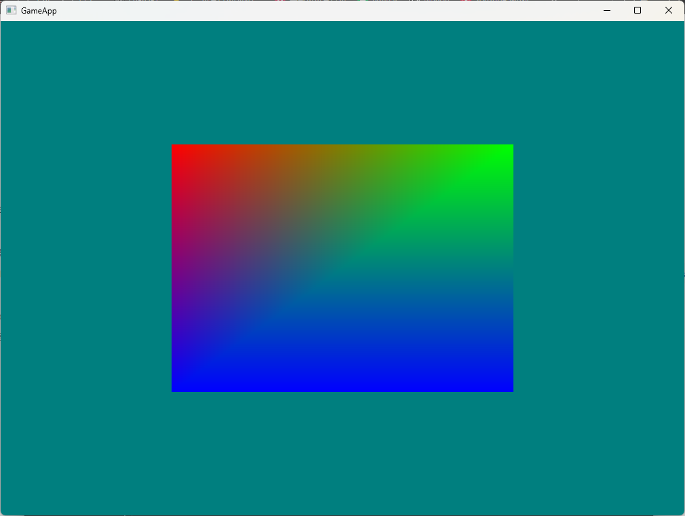
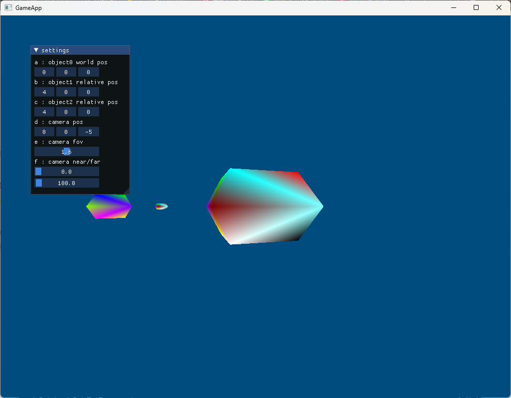
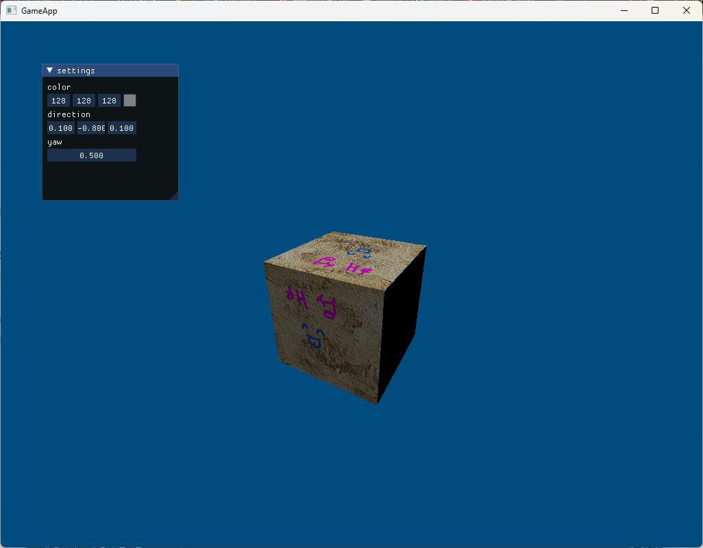
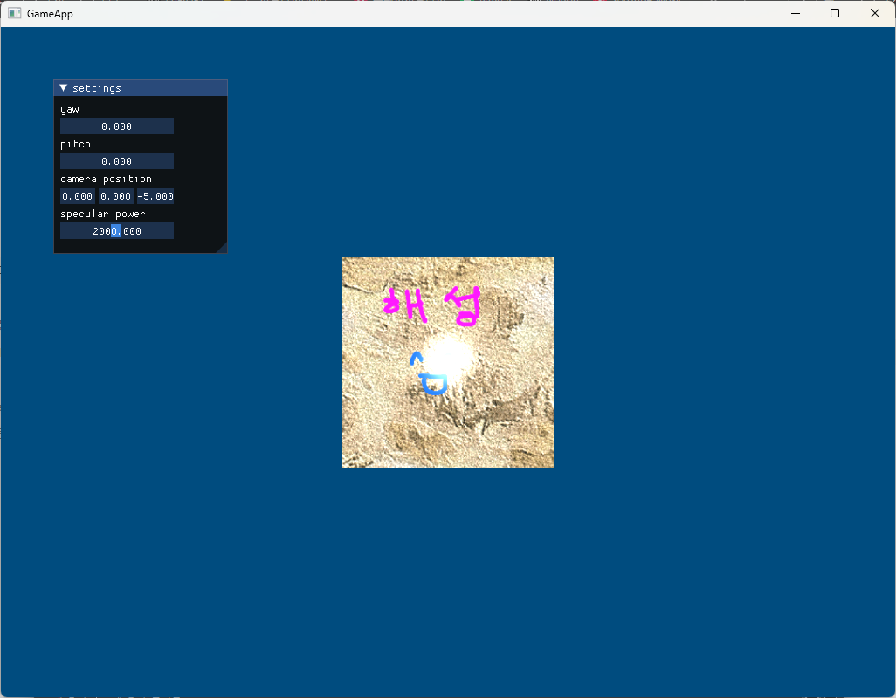
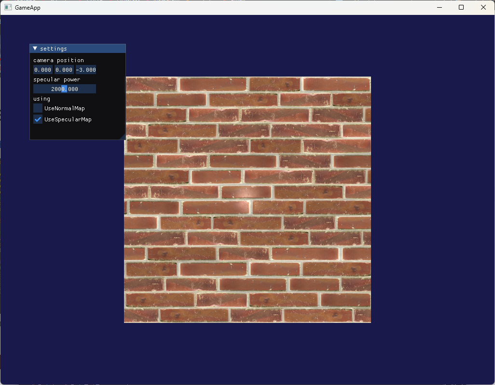
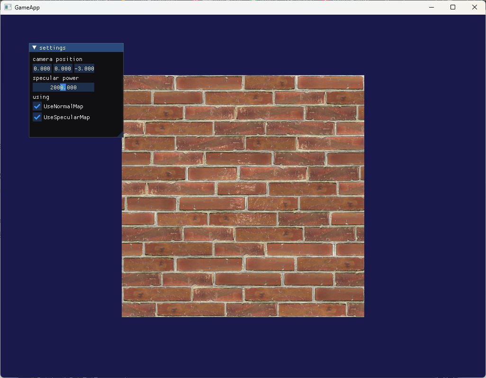
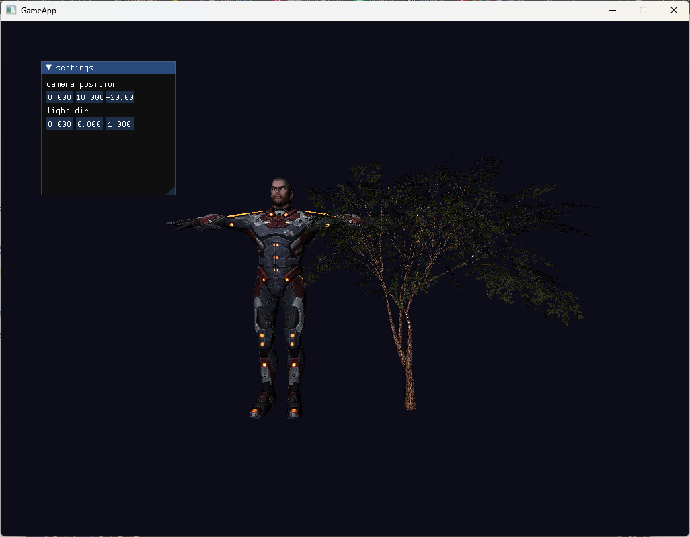
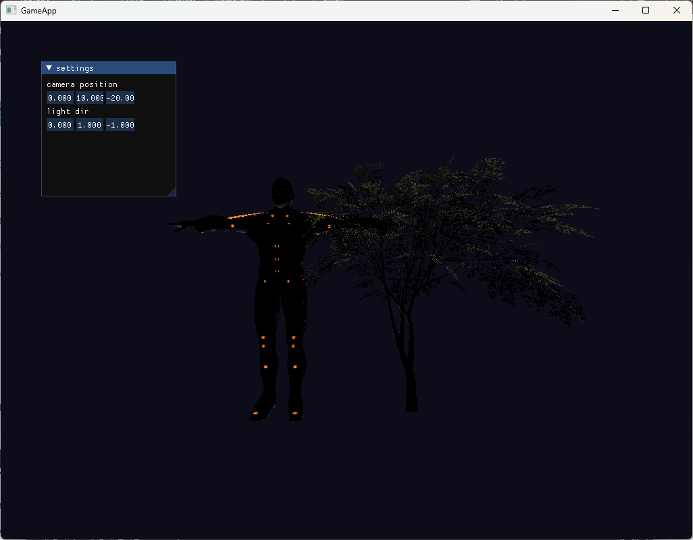
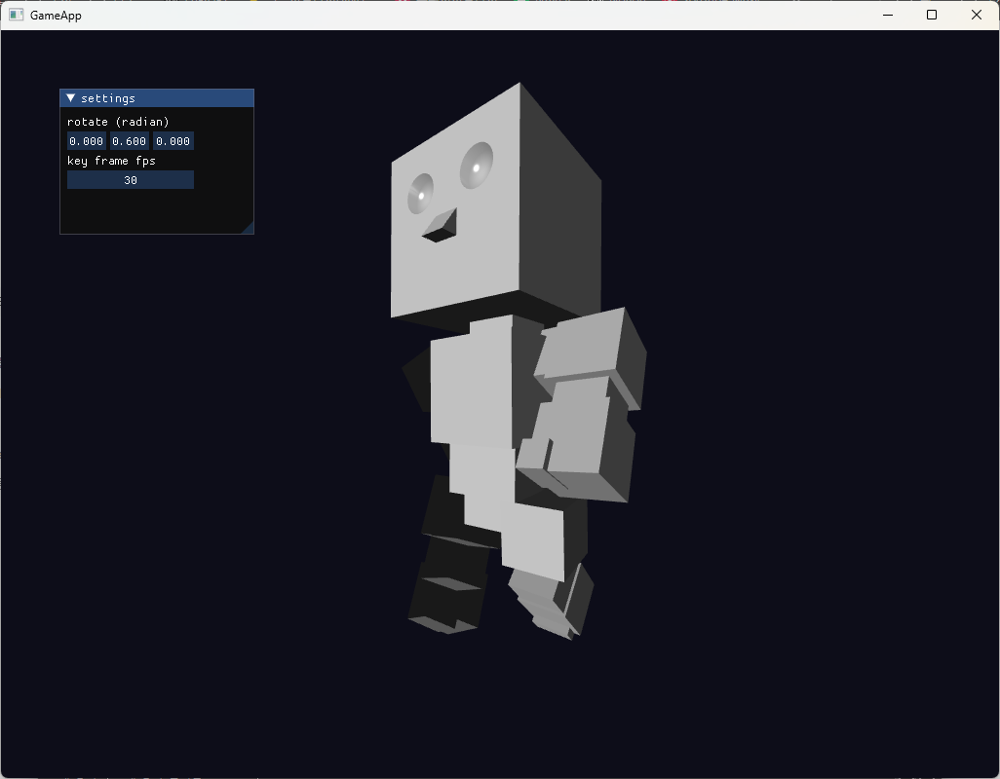
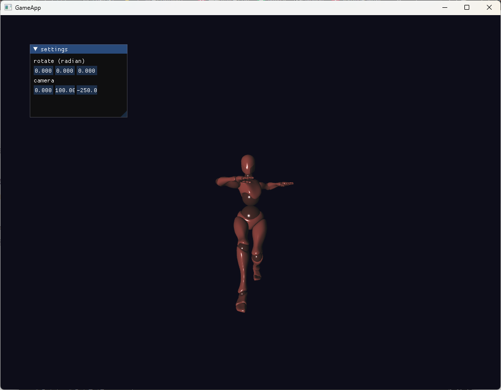

# DX11

> 코드 기록용으로 업로드한 리포지토리입니다.  
> 리소스 및 외부 라이브러리는 포함하지 않습니다.  
> 프로젝트를 실행할 수 없습니다.  

## 📌 프로젝트 개요
DirectX를 활용하여 다양한 파일 렌더링을 실습한다.

### 🛠 개발 환경
- Language: C++17
- Libraries: Win32 API, Direct3D 11, DirectXTK, ImGui, Assimp
- Platform: Window 11, visual studio 2022

### 🔗 리소스 출처
- 여러가지 3D 파일 및 맵 이미지: 교수님
  
---

## 🔍 결과물

#### Direct3D 렌더타겟 출력 

#### 음영 처리와 텍스처 맵핑

#### 노멀 매핑

#### FBX 모델 로드

#### 애니메이션 로드

---

## 🔧 개선사항
- SVN에서 작업하였는데, 이전 버전을 복원하지 못하고 있는 상황이다.
- 렌더 큐와 컬링 구현을 통한 렌더링 효율성 극대화
- 리소스 관리를 위한 레퍼런스 카운터 도입
- 그림자 처리 기술 학습 및 구현
- Physically-Based Rendering (PBR), IBL 구현
- 포스트 프로세스 공부

